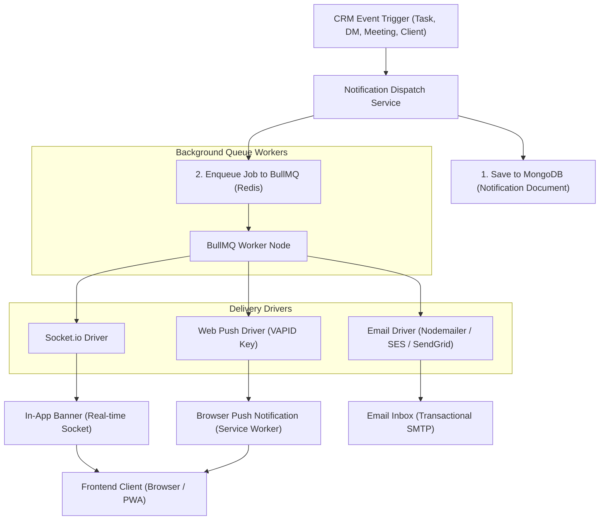

# BizzBuzz CRM — Production-Grade Notification Architecture

This document provides a highly scalable, production-grade notification architecture blueprint for the BizzBuzz CRM. It outlines the data schema, delivery mechanics (real-time in-app sockets, browser push, and email), event-driven triggers, and backend queueing systems to ensure reliable, high-performance messaging across all devices.

---

## 1. Architectural Flow Overview



---

## 2. Database Models & Schema Design

To support read/unread states, user settings, archiving, and multi-channel delivery, we define two critical schemas in MongoDB: `Notification` and `NotificationPreference`.

### 2.1. The `Notification` Schema
This holds individual logs of notifications for audit trails and in-app feed fetches.

```javascript
const mongoose = require('mongoose');

const notificationSchema = new mongoose.Schema({
  recipient: { 
    type: mongoose.Schema.Types.ObjectId, 
    ref: 'User', 
    required: true,
    index: true // Indexed for fast feed queries
  },
  sender: { 
    type: mongoose.Schema.Types.ObjectId, 
    ref: 'User', 
    default: null 
  },
  type: {
    type: String,
    enum: [
      'task_assigned',
      'task_approved',
      'task_ready_approval',
      'todo_submitted',
      'todo_approved',
      'meeting_scheduled',
      'meeting_reminder',
      'client_update',
      'message_dm',
      'message_channel_mention'
    ],
    required: true
  },
  title: { type: String, required: true },
  message: { type: String, required: true },
  link: { type: String, default: '' }, // URL path for direct redirects on click (e.g. /tasks, /messages/dm-123)
  read: { type: Boolean, default: false, index: true },
  channels: {
    socket: { type: Boolean, default: true },
    push: { type: Boolean, default: false },
    email: { type: Boolean, default: false }
  },
  metadata: { type: mongoose.Schema.Types.Map, of: String } // Additional payload (e.g. taskId, meetingId)
}, { timestamps: true });

// Compound index for rendering unread feeds rapidly
notificationSchema.index({ recipient: 1, read: 1, createdAt: -1 });

module.exports = mongoose.model('Notification', notificationSchema);
```

### 2.2. The `NotificationPreference` Schema
Every user should be in control of how they are notified.

```javascript
const notificationPreferenceSchema = new mongoose.Schema({
  userId: { type: mongoose.Schema.Types.ObjectId, ref: 'User', required: true, unique: true },
  preferences: {
    task_assigned:    { socket: { type: Boolean, default: true }, push: { type: Boolean, default: true },  email: { type: Boolean, default: true } },
    task_approved:    { socket: { type: Boolean, default: true }, push: { type: Boolean, default: true },  email: { type: Boolean, default: false } },
    meeting_reminder: { socket: { type: Boolean, default: true }, push: { type: Boolean, default: true },  email: { type: Boolean, default: false } },
    client_update:    { socket: { type: Boolean, default: true }, push: { type: Boolean, default: false }, email: { type: Boolean, default: false } },
    message_dm:       { socket: { type: Boolean, default: true }, push: { type: Boolean, default: true },  email: { type: Boolean, default: false } }
  },
  webPushSubscription: {
    endpoint: { type: String },
    keys: {
      p256dh: { type: String },
      auth: { type: String }
    }
  }
});
```

---

## 3. Delivery Channels & Drivers

A high-performance notification system routes messages based on **delivery guarantees** and **timeliness requirements**.

### Channel A: In-App (Socket.io)
* **Timeliness**: Immediate (milliseconds).
* **Usage**: Live alert banners, incrementing unread counters, real-time feed updates.
* **Mechanism**: 
  - On connection, each socket joins a private room: `socket.join(`user:${userId}`)`.
  - To broadcast: `io.to(`user:${userId}`).emit('notification:new', notificationObject)`.

### Channel B: Web Push Notifications (Service Workers)
* **Timeliness**: Highly immediate. Runs even when the tab/browser is closed.
* **Usage**: Urgent reminders, inbound direct messages, alerts when offline.
* **Mechanism**:
  - The client registers a **Service Worker** and requests subscription from the browser's Push Service (FCM/Apple Push) using the server's **VAPID Public Key**.
  - Subscription endpoint payload is saved in the `NotificationPreference` schema.
  - The worker uses the `web-push` NPM library to encrypt and deliver payload blocks which the Service Worker receives and displays as native OS system alerts.

### Channel C: Email (SMTP / Trans API)
* **Timeliness**: Delayed (seconds/minutes).
* **Usage**: Rich digest summaries (Weekly Report), contract agreements, official invites.
* **Mechanism**:
  - Utilizes pre-compiled HTML templates (e.g. MJML, Handlebars) for mobile-responsive consistency.
  - Delivered via reliable transactional email services (Amazon SES, SendGrid, Mailgun) over SMTP or direct HTTPS SDK.

---

## 4. Trigger & Routing Matrix

The notification dispatcher routes actions based on the roles of actors involved:

| Event Trigger | Actor | Recipient(s) | Default Channels | Description |
| :--- | :--- | :--- | :--- | :--- |
| **Task Assigned** | Manager / Admin | Assigned Member | Socket, Push, Email | Member gets notified they have a new item in their queue. |
| **Task Ready for Approval** | Member | Task Assigner (Manager/Admin) | Socket, Push | Member clicks "Mark Ready for Approval". Manager is prompted to review it. |
| **Task Approved & Completed**| Manager / Admin | Assigned Member | Socket, Push | Assigner approves the work; assignee receives credit. |
| **Daily Todo Submitted** | Member | Manager / Admin | Socket | Informs managers of their team's active schedules for the day. |
| **Meeting Scheduled** | Organizer | All Invited Members | Socket, Email | Distributes invite with dynamic calendar RSVP triggers. |
| **Meeting Reminder** | System Cron | Attendees | Socket, Push | Triggered 15 mins before `meeting.time`. |
| **Direct Message (DM)** | Sender | Recipient User | Socket, Push (if tab closed) | Standard real-time DM alert. |
| **Client Note Added** | Account Manager | Assigned Team Members | Socket | Alert regarding changes, timeline details, or client status notes. |

---

## 5. Scaling & Queueing Mechanics (Production Grade)

Processing template renders, initiating SMTP connections, and pushing bulk requests to Google/Apple servers are block-heavy procedures. 

To ensure **CORS speed, sub-100ms API response rates, and absolute reliability**, delivery must be offloaded from the main Express HTTP server:

1. **Redis & BullMQ Integration**:
   - The REST API endpoint does not directly send push notifications or emails.
   - Instead, the API saves the database entry and places a lightweight JSON payload in a **Redis Queue** using a library like **BullMQ** (a robust, Redis-backed job processor).
   
2. **Dedicated Worker Processes**:
   - Distinct worker processes (separate threads or microservices) listen to Redis, pull the job block, fetch SMTP/VAPID keys, compile the template, and deliver it.
   - If an email service goes down temporarily, BullMQ handles **exponential backoff retries** automatically, ensuring that no notification is ever lost.

3. **Rate Limiting & Aggregation**:
   - Web Push and Email are throttled to prevent spam. For instance, if a user receives 10 DMs within 1 minute while offline, the worker aggregates them into a single, clean email digest ("You have 10 unread messages") rather than sending 10 individual emails.
